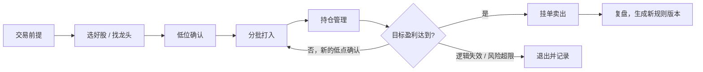

# 持盈路线 · 交易纪律工作台

一个可迭代的股票交易路线原型，围绕“选好股、分批打入、确认低点、达到目标盈利后挂单卖出”建立检查路径。

## 初始路线



叶子规则统一使用“通过 / 待确认 / 不通过”。待确认不生成买入动作；不通过进入观察或退出路径。挂单、部分成交和全部成交是不同状态。

## 运行

直接打开 `index.html` 即可使用，也可以在本目录运行：

```bash
python3 -m http.server 4173
```

目标盈利率默认为 10%，可在右下角编辑。初版支持完整的本地闭环：记录低点、记录分批成交、达到目标后生成挂卖单、标记卖出成交、查看执行日志和创建规则版本。所有状态保存在当前浏览器的 `localStorage` 中，不连接行情或交易账户。

公网演示：<https://krismurdock.github.io/stock-route-system/>

端到端检查：

```bash
python3 -m http.server 4173
BASE_URL=http://127.0.0.1:4173 node tests/e2e.mjs
```
