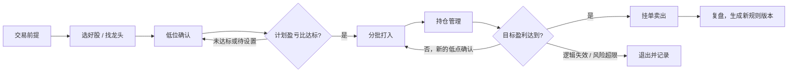

# 持盈路线 · 交易纪律工作台

一个可迭代的股票交易路线工作台，适用于 **A 股 + 港股通**。以计划盈亏比为主，持仓时长用于复盘，不预设固定周期。

## 初始路线



叶子规则统一使用“通过 / 待确认 / 不通过”。待确认不生成买入动作；不通过进入观察或退出路径。挂单、部分成交和全部成交是不同状态。

## 运行

直接打开 `index.html` 即可使用，也可以在本目录运行：

```bash
python3 -m http.server 4173
```

点击交易前提、低位、分批、持仓或卖出节点，可以编辑当前候选的市场、入场价、失效价、目标价、每股往返费用与滑点、最低盈亏比及市场核验状态。最低盈亏比默认待设置，费用不能留空（填 0 表示暂不计）。

计划盈亏比 =（目标价 − 入场价 − 费用）÷（入场价 − 失效价 + 费用）。例如 100 入场、95 失效、110 目标、费用 0 时为 2:1；这是计算示例，门槛由用户设置。这里只计算本笔计划，补仓仍须复核整仓风险。港股通使用港币报价估算，人民币实际结算还受汇率和真实费用影响。

10% 保留为可编辑的初始止盈模板，通过按钮填入目标价，不自动覆盖已保存计划。卖出记录使用所选候选的目标价对应涨幅，用户手动输入的涨幅不代表券商核验的净收益。

低点确认绑定候选及当前计划，一次确认只支持一笔买入；编辑计划使未执行确认失效。计划及叶子状态按候选隔离，日志保留操作当时的计划快照，新版本保存当前计划快照，历史日志不会被新计划覆盖。

所有数据保存在当前浏览器的 `localStorage` 中，不跨设备同步，也不连接行情或交易账户。市场核验依赖用户确认；系统未接入港股通资格或交易日实时校验。挂卖单按钮仅记录用户操作，未向券商发送订单。

公网演示：<https://krismurdock.github.io/stock-route-system/>

端到端检查：

```bash
npm ci
npx playwright install chromium
npm test
python3 -m http.server 4173
# 另一个终端执行（也可用 BASE_URL 指向公网地址）
BASE_URL=http://127.0.0.1:4173 npm run test:e2e
```
